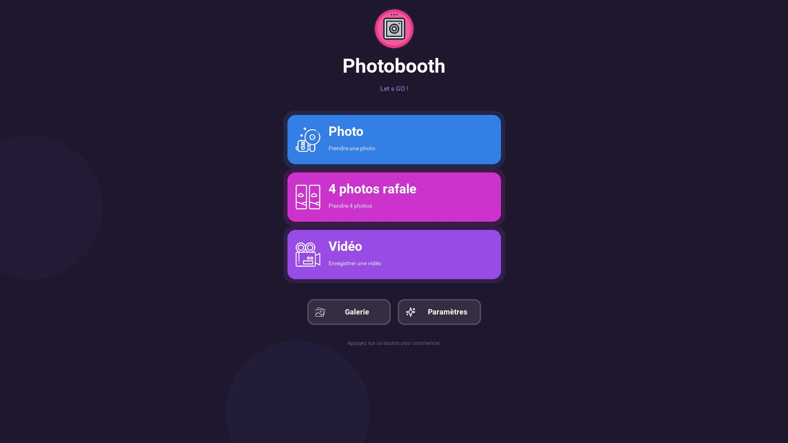

# Application Photobooth pour windows gratuite 💎

## Free Photobooth Application - Logiciel de Borne Photo Professionnel

Transformez vos événements avec une application photobooth complète et personnalisable
Application Photobooth est un logiciel de borne photo innovant développé en Python, conçu pour capturer et immortaliser vos moments les plus précieux lors d'événements, mariages, soirées d'entreprise ou animations commerciales.
Une solution photobooth tout-en-un pour professionnels et particuliers.

Notre application de photobooth offre une expérience utilisateur intuitive et des fonctionnalités avancées qui rivalisent avec les solutions professionnelles du marché. Que vous soyez organisateur d'événements, photographe professionnel ou simplement à la recherche d'une animation originale pour votre fête, ce logiciel répondra à tous vos besoins.
## Captures d'écran

## Fonctionnalités

*   **Mode Photo :** Prenez des photos uniques avec une variété de styles graphiques (Couleur, Noir & Blanc, Sépia, etc.).
*   **Mode Rafale :** Capturez une série de quatre photos qui sont ensuite combinées en une seule image créative. 
*   **Mode Vidéo :** Enregistrez de courtes vidéos d'une minute maximum avec du son pour immortaliser des moments animés.
*   **Superpositions :** Appliquez des cadres et des superpositions amusantes à vos photos et vidéos.
*   **Galerie Média :** Parcourez facilement toutes vos photos et vidéos sauvegardées dans une galerie intégrée.
*   **Personnalisation Avancée :**
    *   Modifiez le logo et l'arrière-plan de l'application.
    *   Sélectionnez la caméra à utiliser parmi les périphériques disponibles.
    *   Ajustez la résolution de la caméra et/ou appliquez une rotation de 180°.
    *   Protégez l'accès aux paramètres avec un mot de passe personnalisable. 
    *   Personnalisez le sous-titre de l'écran d'accueil.

## Technologies Utilisées

*   **Python :** Le langage de programmation principal de l'application.
*   **Kivy :** Un framework open-source pour le développement d'applications multi-plateformes avec une interface utilisateur riche.
*   **OpenCV :** Une bibliothèque de vision par ordinateur utilisée pour la capture et le traitement d'images et de vidéos.
*   **Sounddevice & SoundFile :** Des bibliothèques pour l'enregistrement et la manipulation de l'audio.
*   **PyInstaller :** Pour la création de l'exécutable de l'application.

## Installation

Pour installer, téléchargez le contenu du repo (photobooth.exe + assets) et lancer l'application sur Windows.
suivez les étapes ci-dessous :
Téléchargez la dernière release et lancez photobooth.exe

## Configuration

L'application peut être configurée via le fichier `settings.json`, qui est créé au premier lancement. Voici les options disponibles :

*   `camera_index`: L'index de la caméra à utiliser (commence à 0).
*   `camera_rotate_180`: `true` pour pivoter la caméra de 180 degrés, sinon `false`.
*   `camera_resolution`: La résolution de la caméra (ex: "1280x720").
*   `photo_mode`: Le mode photo par défaut (ex: "Color").
*   `overlay`: La superposition par défaut à appliquer. 
*   `settings_password`: Le mot de passe pour accéder à l'écran des paramètres.
*   `subtitle`: Le sous-titre affiché sur l'écran d'accueil.

## Licence

Ce projet est sous licence MIT. Voir le fichier `LICENSE` for plus de détails.

## Plus d'informations💎

Découvrez toutes les fonctionnalités sur le site [Photobooth Windows](https://www.olybop.fr/photobooth-windows/)
